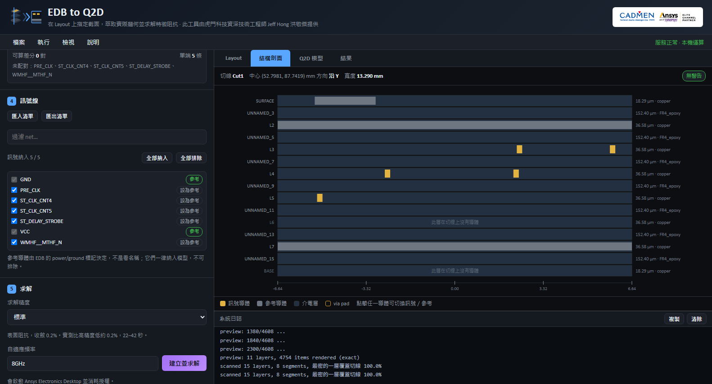
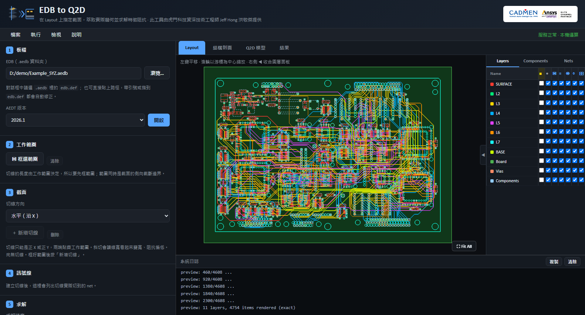
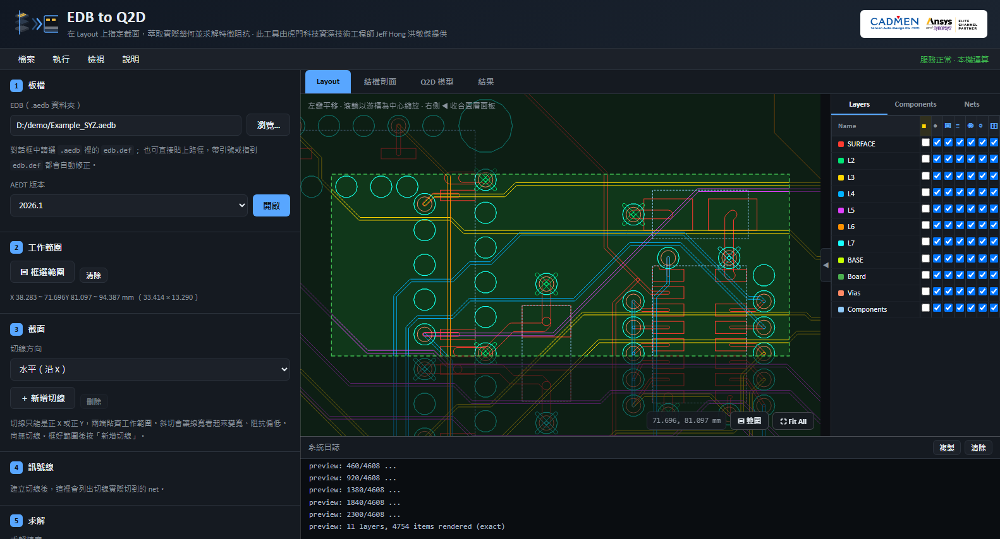
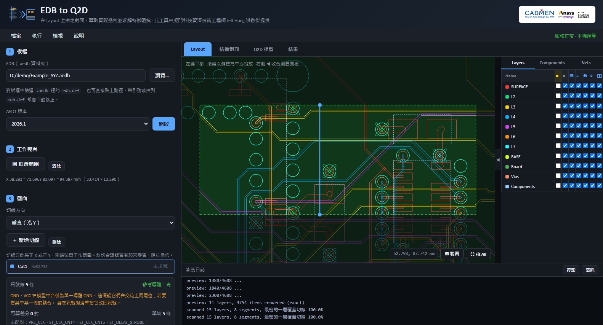
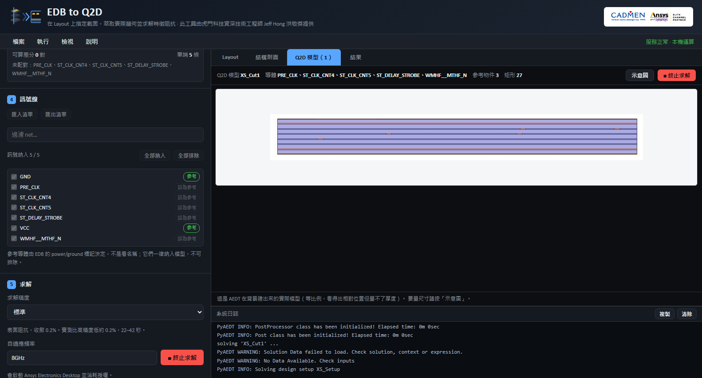
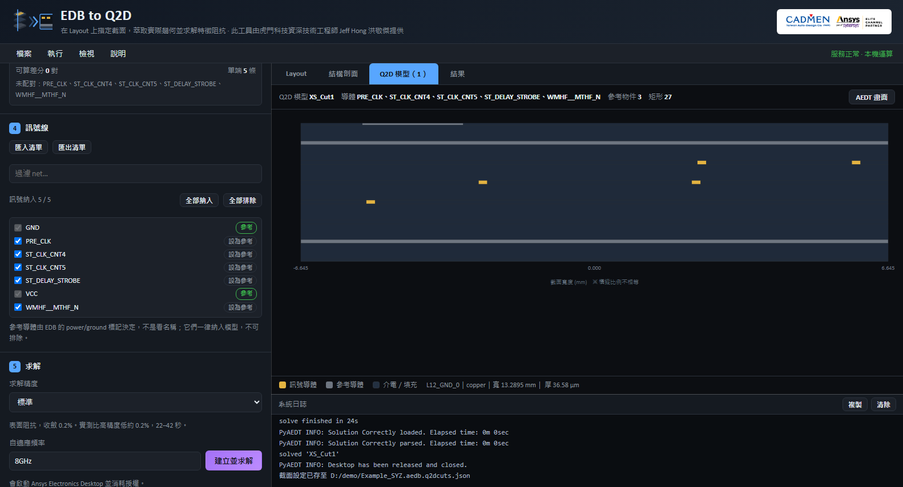
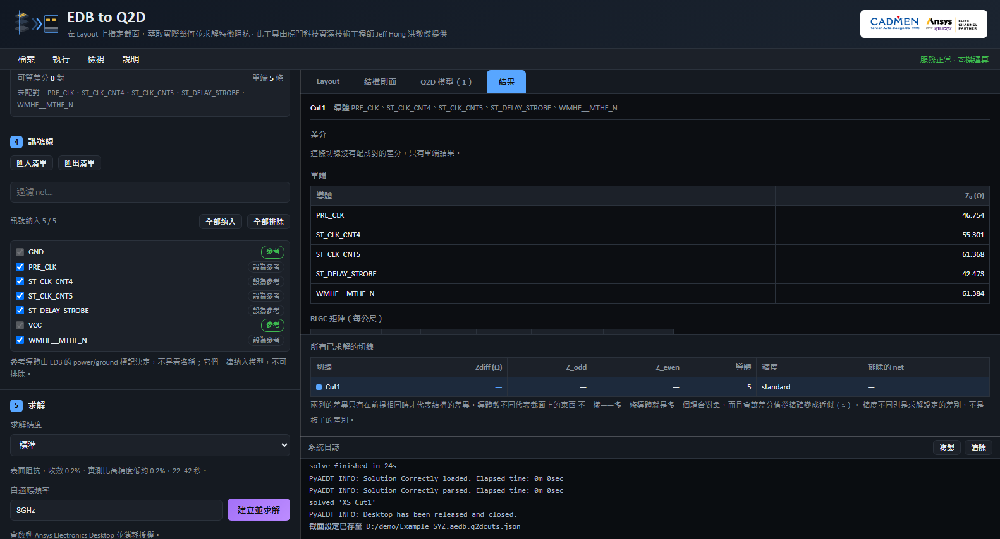
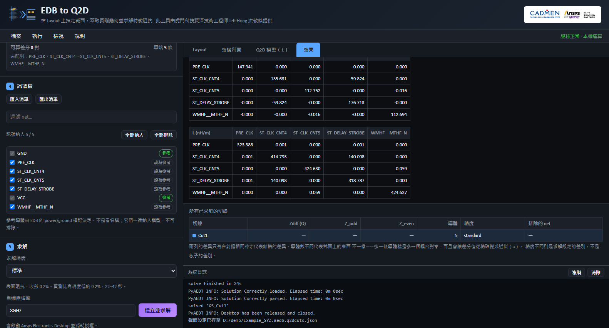
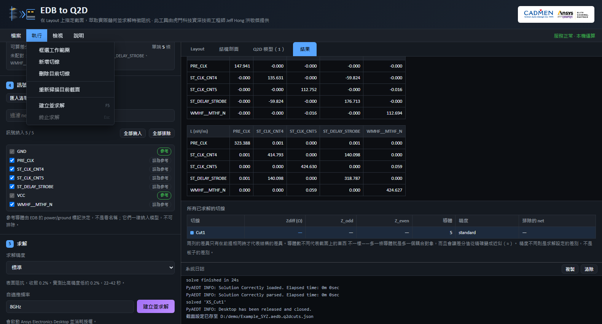
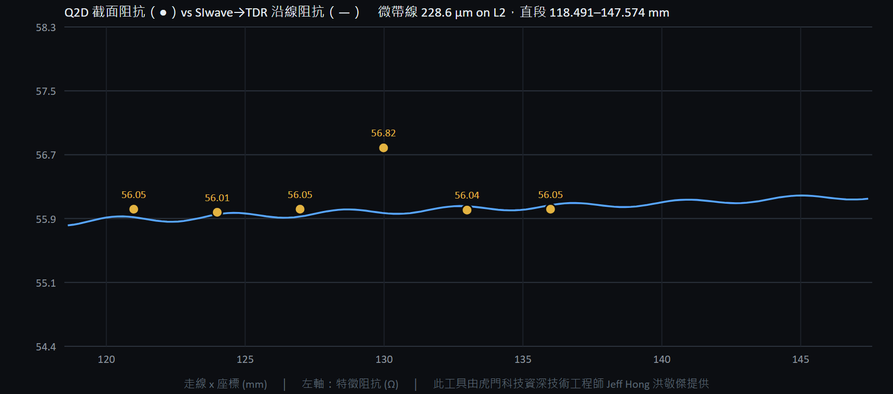

# EDB → Q2D 截面萃取工具（前端展示）

**繁體中文** · [English](README.en.md)

在 Ansys EDB 的 2D Layout 上指定一條切線，把該處**真實存在**的層截面萃取出來，
在 Ansys Q2D Extractor 中重建成二維模型，求解特徵阻抗。

> **本儲存庫只包含前端。** EDB 讀取、截面掃描與 Q2D 求解由私有後端執行，未在此公開。
> 詳見 [公開範圍](#公開範圍)。



---

## 這個工具解決什麼問題

當訊號完整性的問題是「這個截面的特徵阻抗是多少」，二維萃取器幾分鐘就能回答；
三維全波則要花數小時建模，得到的答案還得再從 S 參數反推出來。

真正的困難在於**怎麼把截面送進二維萃取器**：

- **Q2D 沒有從 HFSS 3D Layout／EDB 直接切出截面的功能。**
- SIwave 的「Export to 2D Extractor」是以**疊構**為基礎產生理想截面，只吃線寬、間距與上下參考層。
  它無法表達該位置實際的樣子——平面局部挖空、訊號層上的同層接地導體、
  只以窄帶形式存在的參考面、或是穿過切面的 padstack pad。
- 手工重畫既慢又容易出錯。開發過程中，手建模型曾假設 pad 下方有完整參考面，
  但那層平面**根本不在那裡**。手建模型算出 57 Ω，忠實還原幾何的模型算出 61 Ω。

這個工具直接讀取資料庫裡**真正存在**的幾何。

---

## 實際跑一次

以下截圖全部取自**同一次操作**，板子是 Ansys SIwave 訓練教材的示範板，
不是任何客戶的設計。

### 1．開啟板檔

8 個導體層、4608 個圖元，精確渲染（非降級近似）。右側是 SIwave 風格的圖層面板，
七個欄位分別控制 Fill／Show／Planes／Traces／Pads／Vias／Elements。



### 2．框選工作範圍

整片 200 mm 的板子上要對準一條 0.1 mm 的走線，不是介面問題，是尺度問題。
先把注意力縮到一小塊，範圍外壓暗。

這個範圍同時是兩件事：**切線的長度由它決定**，而它的左右邊界就是截面的
**側向截斷邊界**——框太窄會把回流路徑切掉，阻抗偏高。



### 3．放切線

選方向後在範圍內點一下，兩端自動貼齊工作範圍。

**切線只能是正 X 或正 Y。** 斜切會讓導體寬度看起來變寬（45° 時 +41%），阻抗直接偏低；
而滑鼠很難拉出真正水平的線，差 1° 你看不出來，數字卻已經錯了。所以工具不提供角度，
只提供一個座標。

下方會列出這條切線的求解計畫：訊號線幾條、有沒有參考導體、可算幾對差分，
以及哪些參考網路會被合併。



### 4．檢查結構剖面

這是**即將建立的 Q2D 模型**的所見即所得預覽，也是唯一能在花掉一次授權之前抓到錯誤的地方。

**所有疊構層一律列出**，切線上沒有導體的層會明確標示留白——把空層省略掉，
正是參考面被誤判的成因。黃色是訊號導體、灰色是參考導體、深藍是介電層，
點任一導體即可切換角色。

左側同時是訊號線清單：`GND` 與 `VCC` 帶著鎖定的「參考」標籤（依 EDB 的
power／ground 旗標判定，不是看名稱），其餘五條是訊號，可逐條排除或提升為參考。


### 5．求解前先看模型

AEDT 在背景執行、不開視窗，所以「Q2D 模型」分頁顯示的是 **AEDT 自己畫的那張截面圖**——
沒有視窗可看的時候，這是「Q2D 裡真的有什麼」的唯一直接證據。發現不對可以立刻終止，
已完成的截面會保留。



它是等比例的，35 µm 的銅箔在 0.8 mm 的疊構上只有幾個像素，量不了尺寸。
要量層厚與線寬就切到示意圖，那裡縱向被刻意放大，滑過任一矩形可看名稱、材料與尺寸。



### 6．結果

五條訊號導體對合併後的 `GND`，標準精度、8 GHz，**24 秒**完成。



比較表刻意多列三欄：**導體數**、**求解精度**、**排除的 net**。
兩列的差異只有在這三欄相同時，才代表結構的差異——導體數不同代表截面上的東西不一樣，
多一條導體就是多一個耦合對象，還會讓差分值從精確變成近似。

RLGC 矩陣的非對角項就是耦合。這個例子裡只有 `ST_CLK_CNT4` 與 `ST_DELAY_STROBE`
之間有顯著的互容（−59.8 pF/m）與互感（140 nH/m），其餘配對幾乎為零——
矩陣直接說出這兩條走線是鄰居。



### 介面

除了左側的步驟面板，也有檔案／執行／檢視／說明選單列，
含 `Ctrl+O`、`Ctrl+S`、`F5`、`Esc`。選單裡沒有任何「只能從選單做」的功能，
做不到的項目變灰而不是消失。



---

## 前端做了什麼

| 元件 | 負責 |
| --- | --- |
| `Preview2D.tsx` | 2D Layout 畫布：平移、以游標為中心縮放、Fit All、單層聚焦、SIwave 風格圖層表、框選與切線拖曳 |
| `CrossSectionView.tsx` | 結構剖面：列出所有疊構層、導體角色切換、安全性提示分級 |
| `Q2DModelView.tsx` | Q2D 模型：顯示 AEDT 匯出的截面圖並在瀏覽器端裁掉白邊，或切換為縱向放大的示意圖 |
| `NetPanel.tsx` | 訊號線清單：排除／提升為參考、清單匯入匯出、參考導體保護 |
| `ResultsView.tsx` | 結果：差分與單端阻抗、RLGC 矩陣、跨切線比較（含前提欄位） |
| `MenuBar.tsx` / `BrandMark.tsx` / `HelpDialog.tsx` | 應用程式外殼：選單列、品牌識別、說明對話框 |
| `api.ts` | 與後端溝通：長任務走 job + WebSocket 串流日誌，並保留 REST 輪詢作為狀態的真實來源 |

技術：React 18 + TypeScript + Vite、Canvas 2D、原生 SVG、`allotment` 可拖曳分割版面。
暗色工程實驗室風格，中文用微軟正黑體、英數用 Calibri。

## 執行前端

```bash
cd web_app/frontend
npm install
npm run dev
```

介面會在 `http://localhost:5180` 打開，版面、選單、對話框都看得到。
**但任何需要資料的動作都會失敗**——「開啟」「掃描」「求解」全都打給 `/api`，
而這個儲存庫沒有後端。要看實際運作請看上面的截圖。

---

## 公開範圍

公開的是前端（約 2700 行 TypeScript／CSS）。私有的是後端（約 3600 行 Python）：

| 動作 | 前端做的 | 私有後端做的 |
| --- | --- | --- |
| 選檔案 | 呼叫 `/api/browse` | 開檔案對話框 |
| 開啟板檔 | 呼叫 `/api/open` | 用 **pyedb** 讀 EDB 的幾何、疊構、材料、padstack、網路 |
| 掃描截面 | 呼叫 `/api/scan` | 沿切線逐層取樣，以二分法細化導體區間邊界 |
| 建立並求解 | 呼叫 `/api/build` | 用 **pyaedt** 在 Q2D Extractor 建模並求解 |
| 即時日誌 | `WebSocket /ws` | 獨立子程序串流 |

也就是說，**只有前端無法匯入電路板**——前端完全不碰板檔，它是一個渲染與互動層。
求解另外需要本機安裝 Ansys Electronics Desktop 與 Q2D Extractor 授權，
那在瀏覽器裡本來就做不到。

本儲存庫**不包含**任何客戶設計、板檔資料、Touchstone 結果或授權伺服器設定。

## 驗證

金手指與一般走線兩個截面，在 **2024 R2** 與 **2026 R1** 上分別重跑完整流程，
與基準值逐項比對（Zdiff、Z_odd、Z_even、C11、C12、L11、L12），門檻 ±2%。
實測最大偏差 **0.04%**；跨版本 Zdiff 差 0.0002%，兩版本萃取出的段數與安全性提示完全相同。

載入效能同樣列入驗收：2026 R1 上開一片 2667 圖元的板子從 209 秒（且只有降級預覽）
降到 12.6 秒的精確渲染，拖曳切線重掃從 24.3 秒降到 2.7 秒。

### 與三維 TDR 交叉驗證

上面比對的是工具自己——同一條切線換版本重跑。那抓得到漂移，抓不到系統性偏差：
如果萃取出來的截面每次都以同樣的方式錯，所有關卡照樣會過。

所以另外拿一個**完全不共用假設**的方法來對。同一條微帶線（SURFACE 層、線寬 228.6 µm、
參考面 L2、29 mm 直段）在 SIwave 做三維全波求解，兩個 gap port、掃頻到 20 GHz，
轉成 TDR 沿線剖面；再沿同一直段放 6 條 Q2D 切線得到 `Z₀(x)`，兩者疊圖。



| | 中位數 | 範圍 | 點數 |
| --- | --- | --- | --- |
| **Q2D** 截面解 | **56.053 Ω** | 56.014 – 56.815 | 6 |
| **SIwave → TDR** | **56.053 Ω** | 55.852 – 56.224 | 146 |

中位數差 **0.000%**，6 條切線有 5 條吻合在 ±0.19% 內。作為尺度參考，
Hammerstad 解析式對同樣的 w/h 給 58.9 Ω——比兩個數值解都高 5%。

**唯一的分歧本身就是結論。** x ≈ 130 那條切線 Q2D 高了 1.4%：該處 0.44 mm 外有一個 via，
它的 antipad 在參考面 L2 上挖了洞（C −0.7%、L +2.0%）。TDR 在這裡的空間解析度是 1.42 mm，
而 antipad 只有 0.6–0.9 mm——**它在結構上就看不到**，於是把那個洞平滑進周圍的線裡。
兩個方法的分工因此是量出來的，不是宣稱的：TDR 找得到「沿著真實通道哪裡有問題」，
Q2D 給得出「選定截面的精確阻抗」。

完整方法、數據與過程中排除的四個障礙見
[docs/cross-validation-tdr.md](docs/cross-validation-tdr.md)。

## 技術合作

專業模擬服務與技術合作皆透過虎門科技股份有限公司（TADC）進行，使用公司提供的 Ansys 資源與授權。

- Jeff Hong 洪敬傑｜CAE 技術部資深技術工程師
- 虎門科技股份有限公司（TADC）｜<https://www.cadmen.com/>
- <jeff.hong@cadmen.com>

## 權利聲明

僅供技術展示，保留所有權利。詳見 [NOTICE.md](NOTICE.md)。

本專案為 Jeff Hong 個人技術作品集，非虎門科技股份有限公司（TADC）官方帳號。
Ansys 為 Ansys, Inc. 之商標，本專案與 Ansys, Inc. 無官方隸屬關係。
