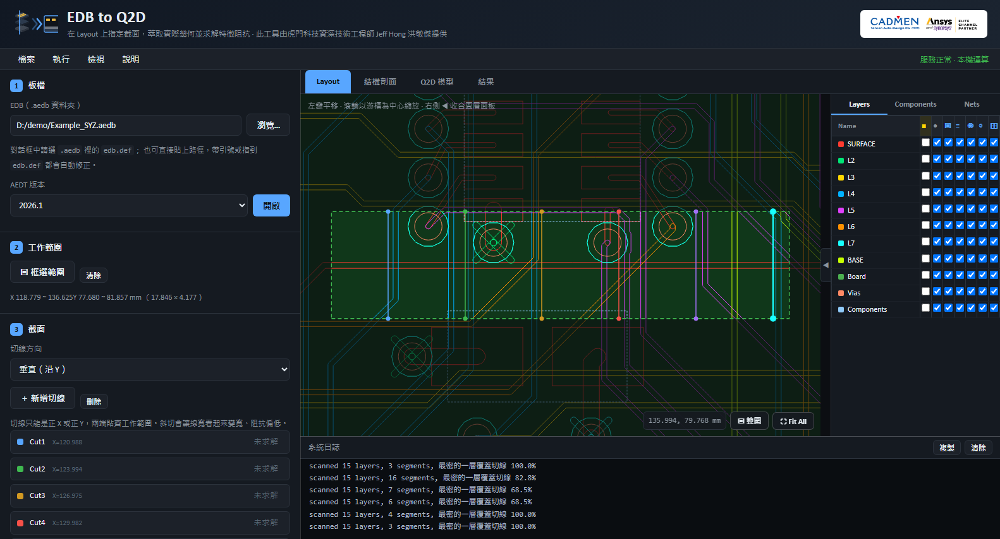
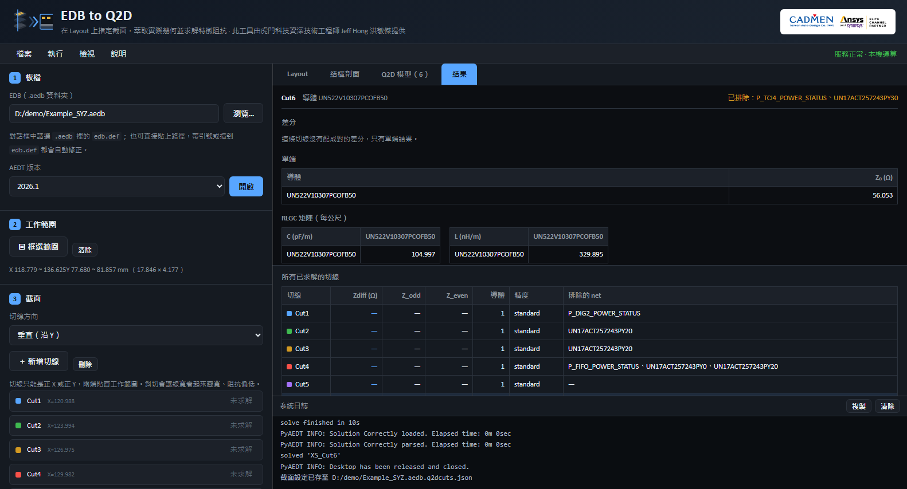

# Cross-validation against SIwave TDR / 與 SIwave TDR 的交叉驗證

---

## Why this comparison is worth making / 為什麼值得做這個比較

The project's own verification suite checks this tool against **itself**: the same cut re-run on
another AEDT version, against stored baselines. That catches drift, not a shared systematic
error. If the extracted cross-section were subtly wrong in a way that repeats every time,
every gate would still pass.

既有的驗證流程比對的是工具**自己**：同一條切線換版本重跑、對存下來的基準。
那抓得到漂移，抓不到系統性偏差——如果萃取出來的截面每次都以同樣的方式錯，所有關卡照樣會過。

So this document compares it against something that shares none of its assumptions: a
**2.5D hybrid electromagnetic solve of the same physical trace** in SIwave, converted to a
time-domain reflection profile. Nothing is shared between the two paths — not the solver,
not the formulation, not the port definition, not even the numerical domain.

因此這份文件拿它去對一個**完全不共用假設**的方法：同一條實體走線在 SIwave 裡的
**2.5D 混合電磁求解**，再轉成時域反射剖面。兩條路徑之間沒有任何共用的東西——求解器不同、
公式化方式不同、激發定義不同，連數值域都不同。

| | Q2D (this tool) | SIwave → TDR |
| --- | --- | --- |
| Solves | 2D quasi-TEM eigenvalue problem on one cross-section | 2.5D hybrid EM solve of the real structure, as S-parameters |
| Domain | Frequency, one adaptive frequency | Frequency sweep → step response in time |
| Solver class | Cross-section eigenvalue | Planar hybrid (SIwave is 2.5D, not 3D full-wave; HFSS is the 3D full-wave solver) |
| Excitation | None; conductors and a reference | Two gap ports referenced to the plane |
| Answers | Z₀ of an infinitely long line with that exact cross-section | Z seen looking into the structure at each point along it |
| Blind to | Variation along the line, 3D effects | Anything shorter than `v·t_r/2` |

**A single Q2D number and a TDR curve are not comparable.** What is comparable is two
profiles: Z₀(x) from cuts placed along the line, against Z(x) from the TDR.

**單一個 Q2D 數字和一條 TDR 曲線不能直接比。** 可比的是兩條剖面：沿線放切線得到的
`Z₀(x)`，對上 TDR 的 `Z(x)`。

---

## Method / 方法

### The test line / 測試對象

Of the 305 nets on the demonstration board, one satisfies every requirement for a fair
comparison. `UN522V10307PCOFB50`:

示範板上 305 條 net 中，只有一條同時滿足公平比較的所有條件：

| Property | Value | Why it matters |
| --- | --- | --- |
| Layer | SURFACE only, no vias | TDR is not dominated by via discontinuities |
| Width | 228.6 µm | — |
| Reference | L2 plane, 152.4 µm below | A clean microstrip |
| Endpoints | U16.23 → U20.4 | Two terminations for two ports |
| Total length | 75.078 mm | — |
| **Longest straight run** | **29.08 mm** at y = 79.756, x 118.491–147.574 | 22× the TDR spatial resolution |

The straight run is what makes the comparison possible: a uniform stretch far longer than
TDR can resolve, so the TDR curve has room to settle onto a plateau.

那 29 mm 直段是比較能成立的關鍵：一段遠長於 TDR 解析度的均勻線，曲線才有空間走出平台。

### Making both models describe the same structure / 讓兩個模型描述同一個結構

| | Q2D | SIwave |
| --- | --- | --- |
| Conductors present | Target net only; every other signal net excluded per cut | Cutout keeps the target net + GND/VCC/P28VA only |
| Lateral truncation | Working region y 77.680–81.857 (±2.09 mm) | ConvexHull cutout, 2.0 mm expansion |
| Reference | GND and VCC merged into one conductor | The same nets as reference |

Both therefore model one microstrip over its reference planes, truncated about 2 mm each
side. 兩者因此描述的都是「一條微帶線在它的參考面上、左右各截斷約 2 mm」。

### Settings / 設定

- **Q2D**: 6 cut lines at x ≈ 121, 124, 127, 130, 133, 136; standard accuracy
  (surface impedance, 0.2% convergence); adaptive frequency 8 GHz.
- **SIwave**: SYZ, interpolating sweep 0.05–20 GHz, 0.5% error tolerance, 4 cores;
  two vertical gap ports referenced to L2; solved in 40 s.
- **TDR**: the product's own `assemble_tdr_analyses` core — not a reimplementation —
  with the step response of S11 extrapolated to DC, Hamming window, 8192 points.

---

## Results / 結果

*Gold markers: Q2D cross-section impedance at each cut. Blue line: SIwave → TDR along the
same straight run. 金點為各切線的 Q2D 截面阻抗，藍線為同一直段的 TDR 沿線阻抗。*

| | Median | Range | Points |
| --- | --- | --- | --- |
| **Q2D** cross-section | **56.053 Ω** | 56.014 – 56.815 | 6 |
| **SIwave → TDR** | **56.053 Ω** | 55.852 – 56.224 | 146 |

**Median difference: −0.000 Ω (−0.000%).**

Point by point, five of the six cuts agree to within **±0.10 Ω (±0.19%)**:

| Cut | x (mm) | Q2D (Ω) | TDR (Ω) | Δ |
| --- | --- | --- | --- | --- |
| Cut1 | 120.988 | 56.053 | 55.949 | +0.104 |
| Cut2 | 123.994 | 56.014 | 55.983 | +0.031 |
| Cut3 | 126.975 | 56.053 | 55.967 | +0.086 |
| **Cut4** | **129.982** | **56.815** | **56.011** | **+0.804** |
| Cut5 | 132.988 | 56.043 | 56.086 | −0.043 |
| Cut6 | 135.994 | 56.053 | 56.096 | −0.043 |

TDR values are the mean over ±0.7 mm around each cut coordinate.
TDR 欄位是各切線座標 ±0.7 mm 範圍的平均。

For scale, the Hammerstad closed-form microstrip formula gives **58.9 Ω** for the same
w/h — 5% above both numerical solutions, because it assumes an infinitely wide ground, a
rectangular conductor and a single bulk Dk.

作為尺度參考，同樣 w/h 的 Hammerstad 解析式給 **58.9 Ω**，比兩個數值解都高 5%——
因為它假設無限寬地平面、矩形截面與單一整塊 Dk。

---

## The one disagreement, and its cause / 唯一的分歧與成因

Cut4 reads 56.815 Ω in Q2D and 56.011 Ω in TDR — a 1.4% gap while every other cut agrees
to 0.2%. It is not noise, and the cause is in the layout.

Cut4 在 Q2D 是 56.815 Ω、TDR 是 56.011 Ω——其餘切線都吻合在 0.2% 內，只有這裡差 1.4%。
那不是雜訊，成因在 Layout 裡。

Net `UN17ACT257243PY0` has a trace terminating at **(129.540, 80.645) on both SURFACE and
L5** — a via, **0.44 mm** from Cut4. A via punches an antipad through every plane it
crosses, including L2, the reference plane for this microstrip. The extracted matrices show
exactly that:

| | Elsewhere | At Cut4 | Change |
| --- | --- | --- | --- |
| C | 104.997 pF/m | 104.252 pF/m | −0.7% (less reference copper) |
| L | 329.895 nH/m | 336.523 nH/m | +2.0% (return path detours) |
| Z₀ | 56.053 Ω | 56.815 Ω | +1.4% |

**TDR cannot see it.** Its spatial resolution here is `v·t_r/2` = 1.42 mm
(v = 1.628 × 10⁸ m/s from group delay, t_r = 17.5 ps at 20 GHz). An antipad is roughly
0.6–0.9 mm across — below the resolution, so it is averaged into the surrounding line.

**TDR 看不到它。** 這裡的空間解析度是 `v·t_r/2` = 1.42 mm，而 antipad 大約 0.6–0.9 mm，
在解析度以下，被平滑進周圍的線裡。

This is the practical division of labour between the two methods, measured rather than
asserted:

- **TDR** finds *where* along a real channel something is wrong, including launches, vias
  and bends that a 2D cut never sees — but only for features longer than its resolution.
- **Q2D** gives the exact impedance of a chosen cross-section, including features far below
  TDR's resolution — but only at the coordinate you cut, and only for a structure that is
  uniform along the line.

兩個方法的分工，量出來而不是宣稱出來的：**TDR 找得到「沿著真實通道哪裡有問題」**，
包含 launch、via、彎折，但只限於長於解析度的結構；**Q2D 給得出「選定截面的精確阻抗」**，
包含遠小於 TDR 解析度的細節，但只在你切的那個座標，而且只對沿線均勻的結構成立。

---

## A side finding: bulk Dk over-estimates delay on microstrip / 附帶發現

The TDR core runs two velocity methods in parallel and shows both:

| Method | v (m/s) | Implied εeff | Resolution |
| --- | --- | --- | --- |
| Group delay from S21 | 1.628 × 10⁸ | **3.39** | 1.42 mm |
| Stackup Dk (4.2) | 1.463 × 10⁸ | 4.20 | 1.28 mm |

Half of a microstrip's field is in air, so its effective permittivity is well below the
substrate's bulk Dk. Using 4.2 stretches the distance axis by about 11%, which pulled the
launch region into what should have been the start of the straight run (a spurious 46.7 Ω).
The group-delay value of 3.39 agrees with the Hammerstad estimate of 3.13.

微帶線的場有一半在空氣裡，εeff 遠低於基材整塊 Dk。用 4.2 會把距離軸拉長約 11%，
把 launch 區拉進本該是直段起點的位置（出現假的 46.7 Ω）。群延遲法的 3.39 與
Hammerstad 估的 3.13 相符。

**On microstrip, trust the group-delay method.** Running both and putting the gap on screen
is what made this visible.

---

## Obstacles worth recording / 過程中值得記下的障礙

Four things blocked this experiment. All are reproducible and none is obvious from the
error message alone.

1. **Only one pyedb gRPC session may exist at a time.** A background pyedb script releasing
   its session tears down the one the web backend is holding; scans then report
   `0 layers, 0 segments` and the log shows
   `EDBSessionException('EDB server is not accessible')`. EDB access from the two tools
   must be serialised.
   **同時只能有一個 pyedb gRPC session**，並行會互相踢掉，症狀看起來像幾何問題。

2. **`custom_extent` strips the reference planes** in this pyedb version. The cutout
   returns `True` and produces a database containing only the signal trace; SIwave then
   refuses with `error 0505 SIwave analysis mandates that at least one plane be present`.
   Use the native ConvexHull extent with `expansion_size` instead. (This is documented in
   the sibling toolkit's `cutout.py`.)
   **本版 pyedb 的 `custom_extent` 會把參考平面裁光**，改用原生 ConvexHull + `expansion_size`。

3. **`Port "…" has invalid upper layer ""` is a symptom of (2), not a port-API error.**
   With no reference copper beneath it, a vertical gap port cannot be defined.

4. **SIwave `error 1004 An unexpected disjoint net`** — cutting a plane leaves isolated
   copper islands sharing a net name. `edb.layout_validation.disjoint_nets()` assigns them
   distinct nets without deleting any copper. Use `order_by_area=False`; the area path hits
   two pyedb defects (`PadstackInstance` has no `layout_obj`, and `_logger` is misspelled).
   Verify the port list is unchanged before and after.

---

## Reproducing / 重現方式

Requires both toolkits, AEDT 2026 R1 with SIwave and Q2D Extractor licences, and
`scikit-rf`. Because a pyedb session cannot be shared, run the two halves in order.

1. **3D half** — copy the board, cut out `UN522V10307PCOFB50` with GND/VCC/P28VA as
   reference (ConvexHull, 2 mm), add two vertical gap ports at the trace ends referenced to
   L2, run `disjoint_nets()`, solve SYZ 0.05–20 GHz, export Touchstone.
2. **Q2D half** — open the same board, select the working region x 118.779–136.625,
   y 77.680–81.857, place vertical cut lines along the straight run, exclude every signal
   net except the target, and solve at standard accuracy.
3. **Compare** — convert the Touchstone to a TDR profile using the trace arc length, and
   overlay it against the cut results.

The extraction and solve steps run in the private back end, which is not part of this
repository. 萃取與求解由私有後端執行，不在本儲存庫內。

The Touchstone file is not committed; this repository does not ship simulation results.
Touchstone 檔案未提交；本儲存庫不收錄模擬結果。
